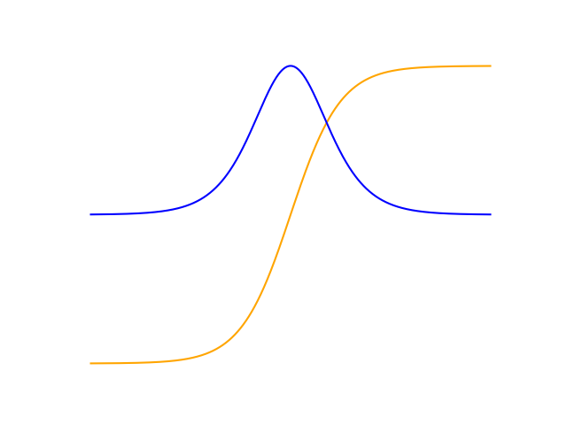

# ToeffiPy
[](https://github.com/ChristophReich1996/ToeffiPy/blob/master/LICENSE)
ToeffiPy is a fully [NumPy](https://numpy.org/) based autograd and deep learning library for 
[Python 3](https://www.python.org/). The core tensor class of ToeffiPy is highly inspired by the 
[live coding challenge](https://www.youtube.com/watch?v=RxmBukb-Om4&list=PLeDtc0GP5ICldMkRg-DkhpFX1rRBNHTCs) 
of [Joel Grus](https://github.com/joelgrus/). His code can be found in [this](https://github.com/joelgrus/autograd/) 
repository. The user experience (nn.Module etc.) of ToeffiPy should be similar to [PyTorch](https://pytorch.org/). 
The main purpose of this library is educational. ToeffiPy should give an inside about how a modern autograd/deep 
learning library works. To implement operations like a convolution as low level as possible, but also efficient, NumPy 
was chosen. Since NumPy is highly optimized, ToeffiPy is suitable for small machine learning projects.


**The full documentation can be found in `docs/html/index.html`.**

Example use:
```python
import autograd
import numpy as np
import matplotlib.pyplot as plt

x = autograd.Tensor(np.linspace(-4, 4, 1000), requires_grad=True)
y = autograd.tanh(x)
y.sum().backward() # Compute gradients
plt.plot(x.data, y.data)
plt.plot(x.data, x.grad.data)
plt.show()
```



# Theory

ToeffiPy can handle Python features like loops or if statements. This is due to the fact that ToeffiPy utilized a 
dynamic backward graph. To compute the gradients of a graph simple
[backpropagation](https://en.wikipedia.org/wiki/Backpropagation) is used. However, **only first-order derivatives are 
supported**.

# Overview

ToeffiPy contains of the following modules:

```
ToeffiPy
└───autograd
    │   function.py
    │   tensor.py
    │   __init__.py
    │
    ├───data
    │   │   dataloader.py
    │   │   dataset.py
    │   │   __init__.py
    │
    └───nn
        │   activation.py
        │   functional.py
        │   layer.py
        │   lossfunction.py
        │   module.py
        │   optim.py
        │   parameter.py
        │   __init__.py
```

ToeffiPy implements all core tensor operations like a simple addition or a matrix multiplication.
The nn package also implements all commonly used 1D and 2D neural network operations like a 2D convolution or batch 
normalization.

## `Tensor`

The core tensor class wraps a NumPy ndarray. The ndarray is stored in `tensor.data`, but should not be accessed 
directly. If the tensor requires grad, `tensor.backward()` can be called to compute the gradients of the tensor and all 
its dependencies. After `.backward()` is called the gradient of each tensor in the graph is stored in the field 
`tensor.grad`.

```python
>>> import autograd
>>> import numpy as np
>>> 
>>> a = autograd.Tensor(1904, requires_grad=True)
>>> b = autograd.Tensor(np.ones((190, 4)))
>>> c = a + b
>>> d = 3 * c
>>> e = d.sum()
>>> e.backward()
>>>
>>> print(a.grad)
Tensor(2280.0, requires_grad=False, shape=())
>>> print(c.grad[0, 0])
Tensor(3.0, requires_grad=False, shape=())
```

## `nn`

ToeffiPy also implements the most common neural network operation like for example `nn.functional.linear` or 
`nn.functional.conv_2d`. However, it is recommended to use the corresponding `nn.Module` implementation.

## `nn.Module`

ToeffiPy supports also modules as known from PyTorch. A simple feed forward neural network can be implemented as follows:

```python
import autograd
import autograd.nn as nn

class FFNN(nn.Module):
    """
    This class implements a simple feed forward neural network.
    """

    def __init__(self):
        """
        Constructor
        """
        # Call super constructor
        super(FFNN, self).__init__()
        # Init layers and activations
        self.layers = nn.Sequential(
            nn.Linear(in_features=1, out_features=16, bias=True),
            nn.ReLU(),
            nn.Linear(in_features=16, out_features=16, bias=True),
            nn.ReLU(),
            nn.Linear(in_features=16, out_features=1, bias=True)
        )

    def forward(self, input: autograd.Tensor) -> autograd.Tensor:
        """
        Forward pass
        :param input: (Tensor) Input tensor
        :return: (Tensor) Output tensor
        """
        # Perform operations
        output = self.layers(input)
        return output

# Init model
ffnn = FFNN()
# Save model
autograd.save(ffnn.state_dict(), 'ffnn.npz')
# Load model
ffnn.load_state_dict(autograd.load('ffnn.npz'))
```

# Examples

* [XOR problem](examples/xor.py)
* [Simple linear regression](examples/regression.py)
* [Simple regression with a neural network](examples/regression_nn.py)
* [MNIST classification with a feed forward neural network](examples/mnist_ff.py)
* [MNIST classification with a CNN](examples/mnist_conv.py)

# Installation

1. Clone repository `git clone https://github.com/ChristophReich1996/ToeffiPy`
2. Navigate to setup.py `cd ToeffiPy`
3. Install `python setup.py install`

# Data

The mnist dataset used in the examples is a subset from the original [mnist dataset by Yann LeCun et al.](http://yann.lecun.com/exdb/mnist/).
